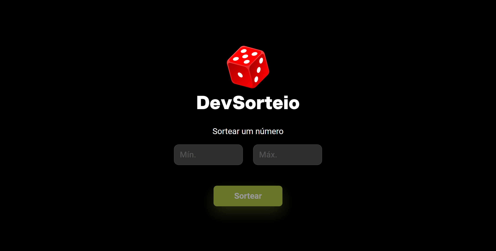

# Sorteador de Número

Projeto criado do zero para treinar as habilidades de HTML, CSS, Javascript e responsividade.

[Figma](https://www.figma.com/design/vQKpjfiPgpLIAXhcldi43Z/DevSorteio?node-id=0-1&t=EjWpf1Wb6xoAoIvo-0)

[Projeto Online](https://sorteador-numero-self.vercel.app/)

## Licença

Este projeto está licenciado sob a [Licença MIT](https://opensource.org/licenses/MIT).

## Status do Projeto

Concluído.
